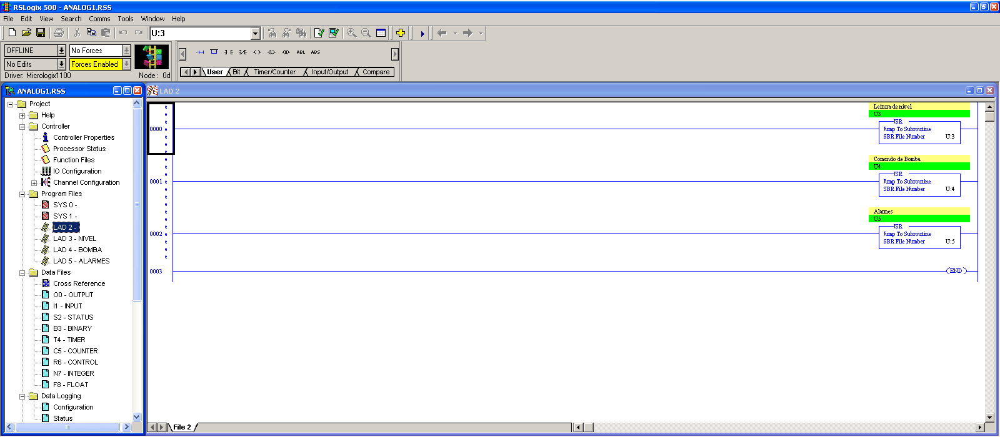
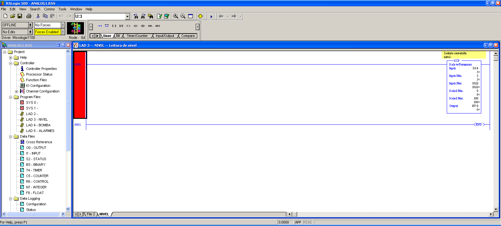
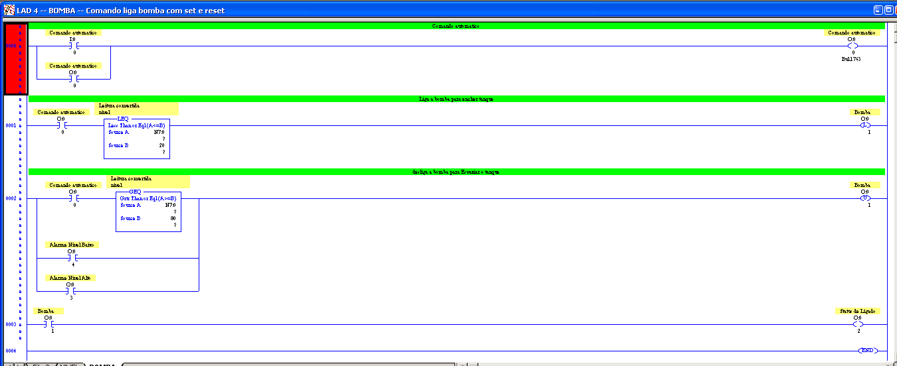
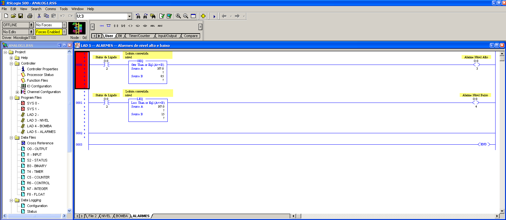

# CONTROLE_NIVEL_TANQUE_MICROLOGIX
Projeto de controle de nivel de um tanque, uma bomba abastece e esvazia pelo consumo, CLP Micrologix 1100 Rockwell.

 
Main

 
  
 
    

Nivel

 
  
 
    
    
Bomba

 
  
 
    

Alarmes

 
  
 
    
